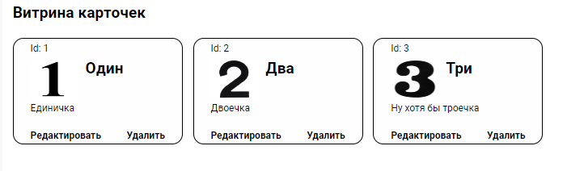
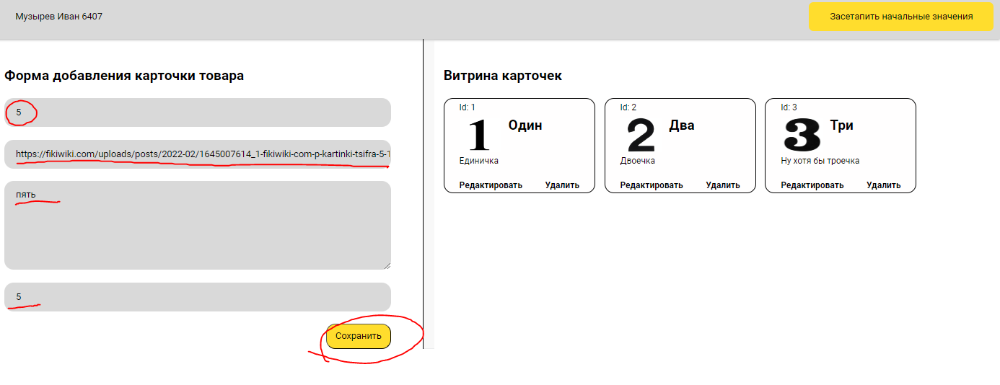
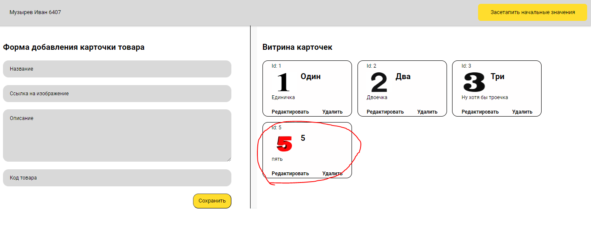

# Empty vite template

Отображение формы

Отображение витрины

Пример вводимых значений

Отображение новых данных

- `npm i` - для установка зависимостей. 
- `npm run dev` - запуск сервера.
- `npm run start:server` - запуск json сервера.
